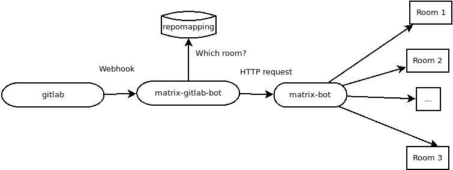
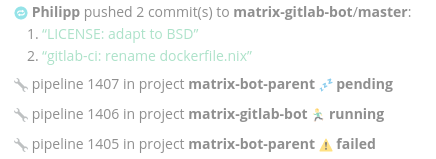
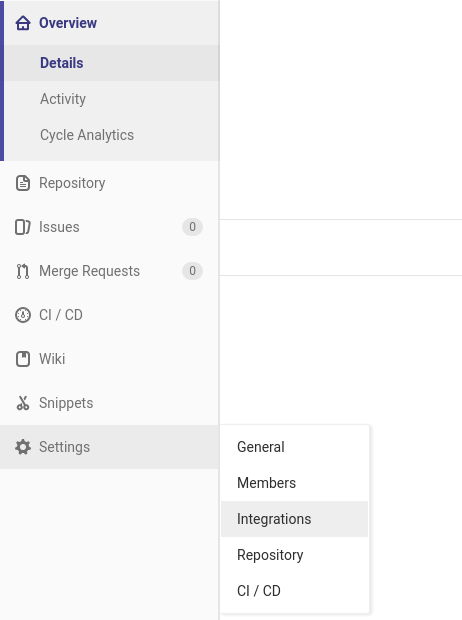
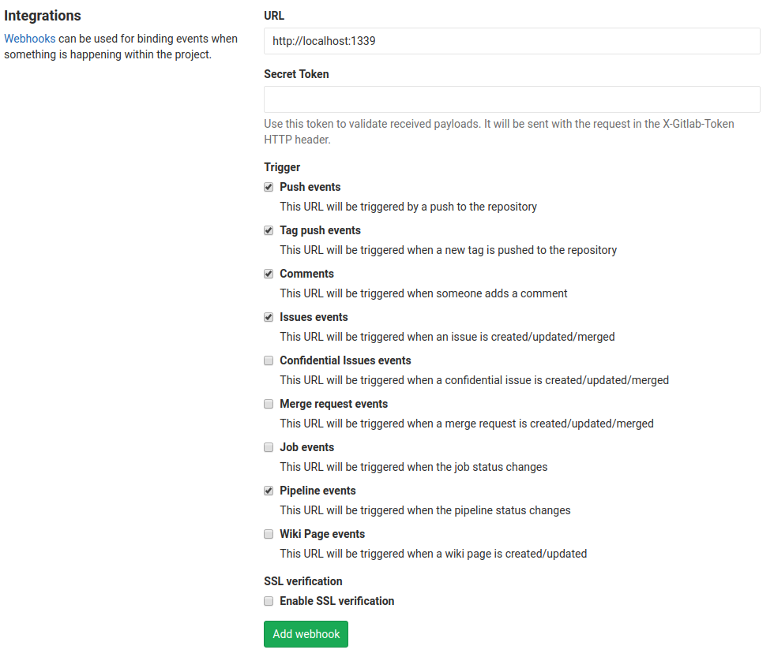

# matrix-gitlab

This bot listens for [GitLab](https://gitlab.com) web hooks and uses the [matrix.org relay bot](https://github.com/plapadoo/matrix-bot) to post the events to [matrix.org](https://matrix.org) rooms of your choice. Using the bot, you get notified of push events, CI pipeline stati, and so on.

## Installation

### Via Docker

The easiest way to install the bot (or just try it out) is via Docker. Just pull the docker image via

    docker run -v ./docs:/etc/matrix-bot:ro -p 1338:1338 -d plapadoo/matrix-gitlab-bot

This will pull the official image from [Docker Hub](https://hub.docker.com/r/plapadoo/matrix-gitlab-bot/) and start the container, thus starting the bot. This will fail unless you fill the configuration directory with some sensible configuration files. The bot needs to know where to find your matrix-bot. Also, there’s a file that contains pairs of “GitLab repository name” and “matrix.org room to notify”. Both the bot URL and the “repomapping” file are configured in the matrix-gitlab-bot.dhall file. The repository contains a sample config file in the `docs/` directory.

### Manually

Assuming you have compiled the bot yourself, you’re left with a single executable file:  `matrix-gitlab-bot-exe`. Without command line arguments, the bot assumes that there’s a configuration file in `/etc/matrix-bot/matrix-gitlab-bot.dhall`, though you can override this using `--config-file` on the command line.

## Compilation from source

### Using Nix

The easiest way to compile the bot or the docker image from source is to use the [nix package manager](https://nixos.org/nix/). With it, you can build the bot using

    nix-build

The resulting files will be located in the `result/` directory. To build the Docker image, use

    nix-build dockerimage.nix

This will, at the last line, output a path that you can feed into `docker load`.

### Using cabal

The bot can be compiled using [cabal-install](https://www.haskell.org/cabal/) by using `cabal install --only-dependencies` and then `cabal install`.

## Configuration

The bot has two configuration files, both written in the [dhall configuration language](https://github.com/dhall-lang/dhall-lang/blob/master/README.md). The format should be self-explanatory. Check out [docs/matrix-gitlab-bot.dhall](docs/matrix-gitlab-bot.dhall) for a sample configuration.

The “repo mapping” configuration file is read each time a web hook request from GitLab. This means you can add a new web hook and configure a room for it without restarting the bot (see below).

## Usage

The bot listens on a HTTP port (specified in `listenPort` in the main configuration file). You have to tell Gitlab to post events to that URL. To do that, go to your project’s settings, then to “Integrations”:

In the resulting screen, on the very top, there’s a section on “Webhooks”. Enter the URL of the matrix-gitlab-bot and the events you want to pass to it. Then click on “Add webhook”. Note that if you’re using the Docker image, make sure both the bot and GitLab can talk to each other – for example, by placing them in the same Docker network.

Next, you have to edit your `matrix-bot-repomapping.dhall` and add a new section like this:

    {
        repo = "gitlab-matrix-bot-test-repo"
      , room = "!EGRmFUjzhLyGZapmhn:mydomain.com"
    }
	
For `repo`, you enter the project name that you see in GitLab. The `room` parameter specifies the *internal room number* from `matrix.org`. You can query the internal room number by pressing the gear icon on the top left in a room and then scrolling all the way down.

To test if it works, click the “Test” button in the GitLab webhooks GUI. If it doesn’t work, `docker logs` or the standard error output can hopefully tell you why.
